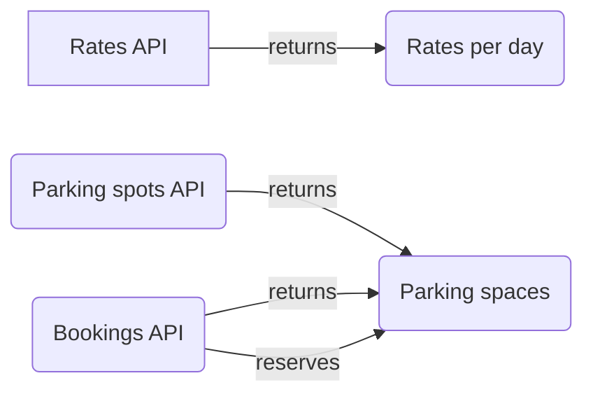

## Sequence Diagram

# To run the project

> `cp .env.example .env`

> `cp api/.env.example api/.env`

change environment variables as needed in `.env` & `api/.env`

> `docker-compose up --build -d`

> `docker exec -it [api_container_name] composer install`

> `docker exec -it [api_container_name] php artisan migrate`

> `docker exec -it [api_container_name] composer run-script phpunit`

for first time install only

> `docker exec -it [api_container_name] php artisan keys:generate:app`

> `docker exec -it [api_container_name] php artisan db:seed`
